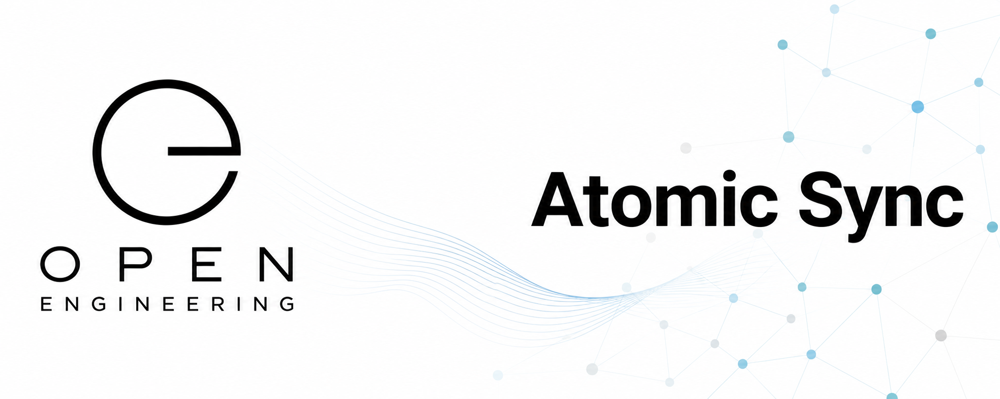

# Open Engineering Atomic Sync

Synchronizing GitHub engineering knowledge into a live semantic graph.



Open Engineering Atomic Sync provides the synchronization layer between GitHub repositories and the Open Engineering knowledge graph powered by AtomicServer.

It continuously discovers engineering repositories, validates their metadata, imports ontologies, and synchronizes engineering elements, relationships, and version information into a federated semantic registry.

GitHub remains the source of truth. AtomicServer becomes the semantic runtime for querying, exploring, and connecting engineering knowledge.

⸻

## Mission

Open Engineering is built around distributed, version-controlled engineering assets.

Each repository owns its own:

* metadata.yaml
* ontologies (.ttl, .owl, .jsonld)
* documentation
* engineering definitions

Atomic Sync transforms these distributed assets into a unified semantic knowledge graph without changing repository ownership or engineering workflows.

⸻

## What this organization provides

* Repository discovery
* Metadata synchronization
* Ontology synchronization
* Relationship synchronization
* Incremental updates
* Change detection
* Synchronization validation
* Traceability back to GitHub
* Semantic graph population
* Synchronization tooling and automation

⸻

## Design Principles

GitHub First

Repositories remain the authoritative source of engineering knowledge.

Atomic Sync never replaces Git.

⸻

## Semantic by Design

Engineering concepts become linked resources rather than isolated files.

Repositories, elements, ontologies, capabilities, stories, devices, characters, flows, and execution platforms are represented as connected resources.

⸻

## Traceable

Every synchronized resource can be traced back to:

* GitHub repository
* source file
* commit SHA
* synchronization timestamp

⸻

## Incremental

Only changed resources are synchronized.

This allows the platform to scale to thousands of repositories without rebuilding the complete graph.

⸻

## Idempotent

Running synchronization multiple times produces the same semantic graph.

⸻

Position in the Open Engineering ecosystem
```
                    GitHub Repositories
                           │
            metadata.yaml • ontology.ttl
                           │
                           ▼
              Open Engineering Atomic Sync
                           │
         ┌─────────────────┼─────────────────┐
         │                 │                 │
         ▼                 ▼                 ▼
   Engineering      Ontology Graph     Relationships
     Resources
         │
         ▼
                    AtomicServer
                           │
                           ▼
                 Open Engineering Map
                           │
         ┌─────────────────┼─────────────────┐
         ▼                 ▼                 ▼
      AI Agents       Backstage        Applications
```
⸻

Responsibilities

Atomic Sync is responsible for:

* discovering Open Engineering repositories
* reading repository metadata
* validating engineering metadata
* importing engineering ontologies
* synchronizing engineering elements
* synchronizing semantic relationships
* synchronizing version information
* publishing synchronization reports

Atomic Sync is not responsible for:

* defining metadata conventions
* defining ontologies
* editing engineering content
* rendering documentation
* replacing GitHub

⸻

Typical synchronization pipeline
```
Repository Discovery
        │
        ▼
Clone / Pull
        │
        ▼
Validate metadata.yaml
        │
        ▼
Load Ontologies
        │
        ▼
Generate Semantic Resources
        │
        ▼
Compare with AtomicServer
        │
        ▼
Synchronize Changes
        │
        ▼
Publish Synchronization Report
```
⸻

## Related Open Engineering organizations

Atomic Sync works closely with:

* Open Engineering Conventions — metadata schemas and validation rules
* Open Engineering Ontologies — shared OWL and RDF vocabularies
* Open Engineering Registries — canonical identifiers and persistent URIs
* Open Engineering Map — visualization and exploration of the engineering graph
* Open Engineering Queries — reusable semantic queries
* Open Engineering Ecosystem — orchestration across the complete platform

⸻

## Long-term vision

Open Engineering Atomic Sync enables a future where engineering knowledge is simultaneously:

* version controlled
* semantically linked
* AI discoverable
* machine understandable
* traceable
* queryable
* federated
* open by design

Rather than treating repositories as isolated islands of information, Atomic Sync continuously builds a living engineering knowledge graph that connects every element across the Open Engineering ecosystem while preserving GitHub as the authoritative source of truth.

⸻

## Contributing

We welcome contributions that improve synchronization, semantic interoperability, ontology integration, validation, and graph consistency.

Together we are building an open, federated, AI-native engineering knowledge graph.
